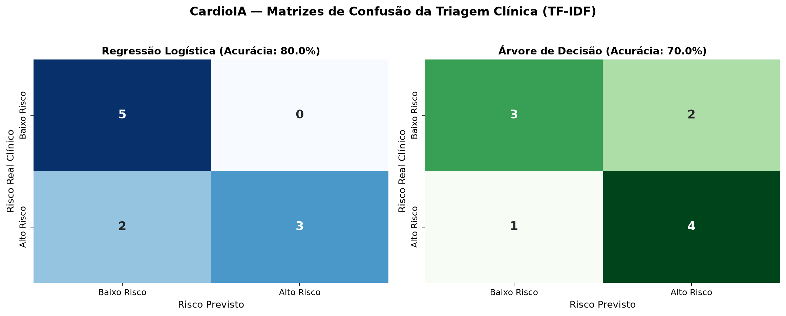
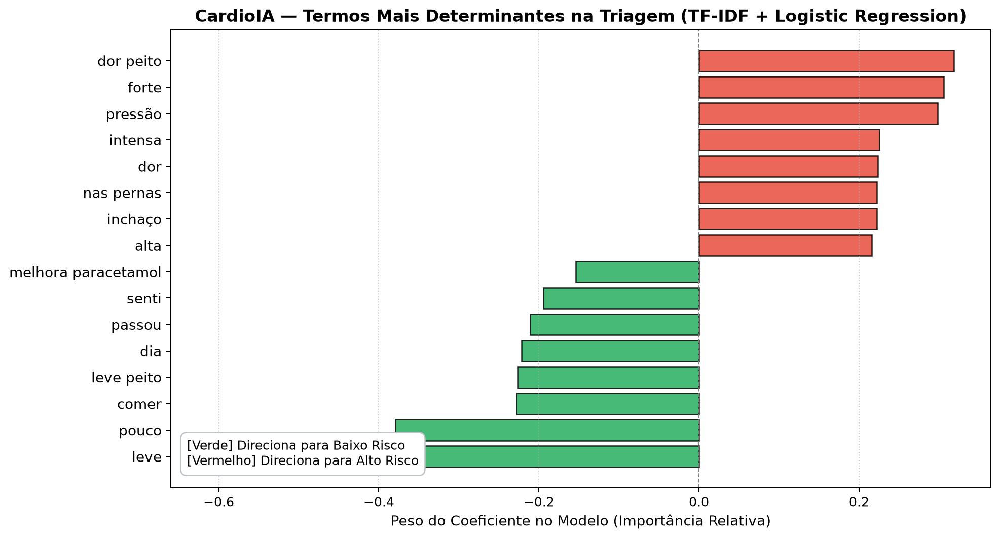
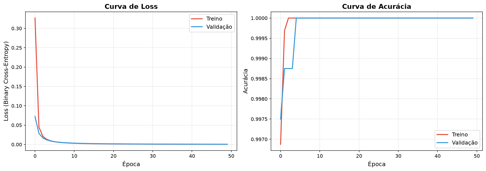
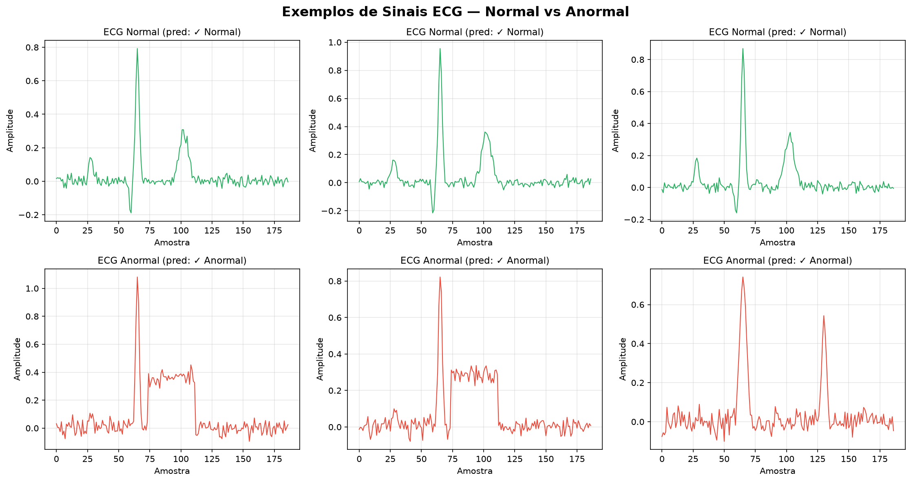

<div align="center">

# 🫀 CardioIA — A Nova Era da Cardiologia Inteligente

### Fase 2: Diagnóstico Automatizado — IA no Estetoscópio Digital
*(Projeto Integrado PBL — FIAP 2025 | Graduação em Inteligência Artificial)*


*Plataforma inteligente que simula o ecossistema de um centro de diagnóstico cardiológico moderno, integrando Processamento de Linguagem Natural (NLP), Ontologias Médicas, Machine Learning de Triagem Clínica, Visão Computacional / Deep Learning em Eletrocardiogramas e Portal Web Responsivo.*

---

[🎬 Vídeo de Demonstração](#-vídeo-de-demonstração) •
[Parte 1 – NLP & Ontologia](#-fase-2--parte-1-frases-de-sintomas--extração-de-informações) •
[Parte 2 – Classificador TF-IDF](#-fase-2--parte-2-classificador-básico-de-texto) •
[Ir Além 1 – Portal React](#-ir-além-1--interface-do-cardioia-portal-react--vite) •
[Ir Além 2 – MLP ECG](#-ir-além-2--diagnóstico-visual-com-rede-neural-mlp) •
[Fase 1 (Histórico)](#-fase-1--batimentos-de-dados-fundamentação) •
[Como Executar](#-como-executar-o-projeto) •
[Equipe](#-equipe)

</div>

---

## 👥 Equipe de Desenvolvimento

| Nome Completo | RM | Responsabilidades Principais |
|---------------|:--:|------------------------------|
| **Gabriela de Andrade Alves** | RM567740 | NLP, Engenharia de Prompts/Ontologia, Portal React & Design System |
| **Leonardo de Mattos Oliveira** | RM568219 | Modelos de Machine Learning, Deep Learning (MLP ECG), Pipelines e Governança |

---

## 🎬 Vídeo de Demonstração

> 📹 **Link do Vídeo Oficial no YouTube (Não Listado):**  
> (youtube.com/watch?v=15xr1NtDW8w&feature=youtu.be) 


---

## 🧭 Visão Geral da Fase 2 (Diagnóstico Automatizado)

Na **Fase 2 do PBL**, o projeto CardioIA avança para o desenvolvimento de soluções aplicadas de diagnóstico automatizado, atuando como o **estetoscópio digital do século XXI**:
- 📝 **Interpretação de Relatos Clínicos:** Extração de sintomas chave em linguagem natural associando-os a patologias via mapa de conhecimento ontológico.
- ⚖️ **Triagem Inteligente de Emergência:** Classificação supervisionada de frases médicas em alto vs baixo risco através de TF-IDF e algoritmos de Machine Learning (Scikit-Learn).
- 🌐 **Portal Clínico Operacional (Ir Além 1):** Interface web desenvolvida em React 19 + Vite com autenticação simulada (JWT fake), proteção de rotas, formulário com `useReducer` e dashboard.
- 🧠 **Diagnóstico Visual e Eletrocardiografia (Ir Além 2):** Rede Neural Artificial (MLP) para detecção de anomalias em séries temporais de sinais de ECG.
- 🛡️ **Governança e Bioética:** Análise de vieses algorítmicos em saúde, assimetria de custos clínicos e diretrizes da LGPD / SBC.

---

## 📁 Estrutura Organizada do Repositório

```
CardioIA/
│
├── README.md                          # Documentação central do projeto
├── LICENSE                            # Licença de uso MIT
├── requirements.txt                   # Dependências Python (scikit-learn, pandas, numpy, etc.)
│
├── data/                              # Bases de dados e ontologias estruturadas
│   ├── sintomas_pacientes.txt         # 10 frases completas de relatos clínicos (Parte 1)
│   ├── mapa_conhecimento.csv          # Ontologia clínica (54 regras de sintomas -> doenças)
│   ├── frases_risco.csv               # 40 frases rotuladas de triagem (20 alto / 20 baixo risco)
│   └── cardio_dataset.csv             # Dataset tabular de 500 pacientes (base Fase 1)
│
├── notebooks/                         # Cadernos interativos Jupyter (.ipynb)
│   ├── 01_extracao_diagnostico.ipynb  # Notebook executável da Parte 1 (NLP & Ontologia)
│   ├── 02_classificador_risco.ipynb   # Notebook executável da Parte 2 (TF-IDF & Scikit-Learn)
│   └── 03_diagnostico_visual_mlp.ipynb# Notebook executável do Ir Além 2 (Deep Learning MLP ECG)
│
├── scripts/                           # Módulos Python autônomos (.py)
│   ├── extracao_diagnostico.py        # Motor de extração de sintomas e regras ontológicas
│   ├── classificador_risco.py         # Pipeline de treinamento e avaliação TF-IDF (Scikit-Learn)
│   ├── mlp_ecg_classifier.py          # Implementação e treinamento da Rede Neural MLP
│   ├── gerar_notebooks.py             # Gerador automatizado dos arquivos .ipynb
│   ├── eda_cardio.py                  # Análise Exploratória tabular (Fase 1)
│   └── gerar_dataset.py               # Gerador sintético de dados tabulares (Fase 1)
│
├── figures/                           # Gráficos e evidências visuais de desempenho
│   ├── 10_classificador_matriz_confusao.png # Matriz de confusão (Regressão Logística e Árvore)
│   ├── 11_classificador_top_termos.png      # Termos TF-IDF mais determinantes no risco
│   ├── mlp_curvas_treinamento.png           # Curvas de perda e acurácia da rede neural
│   ├── mlp_exemplos_ecg.png                 # Traçados de ECG normais vs anormais
│   └── [figuras da Fase 1...]
│
├── cardioia-portal/                   # Aplicação Web Front-End (Ir Além 1)
│   ├── README.md                      # Instruções específicas do portal React
│   ├── package.json                   # Dependências npm (React 19, Vite 8, React Router v7)
│   └── src/
│       ├── contexts/AuthContext.jsx   # Context API + JWT Fake no localStorage
│       ├── components/                # ProtectedRoute e Sidebar responsiva
│       ├── services/api.js            # API simulada de pacientes e agendamentos
│       └── pages/                     # Login, Dashboard, Pacientes e Agendamentos (useReducer)
│
├── docs/                              # Artigos técnicos e literatura médica (Fase 1)
├── assets/ecg_images/                 # Banco de imagens de traçados de ECG (Fase 1)
├── dicionario_dados.md                # Metadados e variáveis clínicas (Fase 1)
└── governanca_dados.md                # Princípios bioéticos, LGPD e análise de viés
```

---

## 🔬 Fase 2 — Parte 1: Frases de Sintomas + Extração de Informações

### 1. Relatos Clínicos: [`data/sintomas_pacientes.txt`](data/sintomas_pacientes.txt)
Contém **10 frases completas e diversificadas** simulando queixas reais de pacientes, contemplando:
- **O que o paciente sente** (sintomatologia primária e secundária)
- **Quando começou** (marcador temporal / tempo de evolução)
- **Como afeta sua rotina** (impacto funcional na vida diária)

*Exemplo:*
> *"Há dois dias estou com uma dor forte no peito que piora quando faço esforço físico, como subir escadas ou carregar compras, e melhora quando fico em repouso."*

### 2. Mapa de Conhecimento Clínico: [`data/mapa_conhecimento.csv`](data/mapa_conhecimento.csv)
Planilha estruturada estritamente no padrão solicitado: `sintoma_1,sintoma_2,doenca_associada`.  
Composta por **54 regras clínicas** mapeando correlações fisiopatológicas:
- `dor forte no peito` + `piora quando faço esforço` $\rightarrow$ **Angina de Peito**
- `aperto no tórax` + `suor frio` $\rightarrow$ **Infarto Agudo do Miocárdio (IAM)**
- `falta de ar` + `acordou durante o sono` $\rightarrow$ **Insuficiência Cardíaca Descompensada**
- `coração dispara` + `ansiedade` $\rightarrow$ **Taquicardia Supraventricular**
- `tornozelos` + `marca demora para voltar` $\rightarrow$ **Insuficiência Cardíaca Congestiva**
- `dor de cabeça latejante` + `não passa com analgésico` $\rightarrow$ **Crise Hipertensiva**
- `espuma excessiva` + `inchaço leve no rosto` $\rightarrow$ **Nefropatia Hipertensiva**

### 3. Motor de Inferência: [`scripts/extracao_diagnostico.py`](scripts/extracao_diagnostico.py) e [`notebooks/01_extracao_diagnostico.ipynb`](notebooks/01_extracao_diagnostico.ipynb)
O algoritmo normaliza o texto e aplica dois níveis de confiança:
- 🔴 **Confiança ALTA (Match Completo):** Ambos os sintomas chave da regra estão presentes no relato.
- 🟡 **Confiança MODERADA (Match Parcial):** Apenas um sintoma foi detectado, sugerindo hipótese diferencial.

**Resultado da Execução:**
```
================================================================================
Total de frases analisadas:           10
Total de diagnósticos sugeridos:       22
Diagnósticos de alta confiança:        12
Diagnósticos de confiança moderada:    10
Regras ativas no mapa:                 54
================================================================================
```
*100% dos 10 pacientes recebem um diagnóstico primário de ALTA CONFIANÇA.*

---

## 🤖 Fase 2 — Parte 2: Classificador Básico de Texto

### 1. Base Rotulada de Risco: [`data/frases_risco.csv`](data/frases_risco.csv)
Base balanceada de **40 frases médicas** rotuladas em:
- **`alto risco` (20 frases):** Sintomas indicativos de síndromes coronarianas agudas, edema agudo de pulmão, síncope e arritmias malignas.
- **`baixo risco` (20 frases):** Dores musculares benignas, fadiga cotidiana, azia e desconfortos passageiros.

### 2. Vetorização TF-IDF
Utilização do `TfidfVectorizer` do **Scikit-Learn** com unigramas e bigramas `(1, 2)` e remoção de *stopwords* da língua portuguesa. Isso permite ao modelo valorizar termos discriminantes como `"falta de ar"`, `"dor forte"` e `"suor frio"`.

### 3. Modelagem Supervisionada e Resultados
Divisão estratificada (75% treino / 25% teste):

| Modelo | Acurácia | Precisão (Alto Risco) | Recall / Sensibilidade | F1-Score |
|--------|:--------:|:---------------------:|:----------------------:|:--------:|
| **Regressão Logística** | **80.0%** | **100.0%** | **60.0%** | **75.0%** |
| **Árvore de Decisão** | **70.0%** | **66.7%** | **80.0%** | **72.7%** |

<div align="center">


*Figura 1: Matrizes de Confusão Comparativas (Regressão Logística vs Árvore de Decisão).*


*Figura 2: Termos com maior peso discriminante no modelo de triagem.*

</div>

### 4. Reflexão sobre Governança, Bioética e Vieses (Requisito PBL)
1. **Sensibilidade vs Especificidade:** Em saúde de emergência, um Falso Negativo (classificar um infarto agudo como "baixo risco") pode resultar em óbito. Logo, o **Recall (Sensibilidade)** é a métrica clínica prioritária sobre a acurácia global.
2. **Viés Demográfico de Gênero:** Mulheres e pacientes idosos frequentemente apresentam sintomas atípicos de infarto (como fadiga isolada, dor no estômago ou náusea). O modelo deve ser auditado para evitar que a ausência de dor torácica típica subestime a gravidade nesses grupos.
3. **Princípio Human-in-the-Loop:** O algoritmo deve atuar estritamente como apoio à decisão e priorização de filas, sob supervisão direta do profissional médico ou enfermeiro de triagem.

---

## 🌐 Ir Além 1 — Interface do CardioIA (Portal React + Vite)

Aplicação web completa desenvolvida com **React 19 + Vite 8** simulando um portal cardiológico profissional.

<div align="center">

*Acesse a documentação completa do portal em [`cardioia-portal/README.md`](cardioia-portal/README.md)*

</div>

### Recursos Implementados:
- 🔐 **Autenticação Simulada com Context API:** Gestão de login com token JWT fake gerado e armazenado no `localStorage`, com suporte a expiração de sessão.
- 🛡️ **Proteção de Rotas:** O componente [`ProtectedRoute`](cardioia-portal/src/components/ProtectedRoute.jsx) assegura que telas clínicas só sejam visualizadas após autenticação.
- 📋 **Listagem de Pacientes:** Consumo assíncrono de API simulada com busca dinâmica por texto e filtro por nível de risco (Alto, Moderado, Baixo).
- 📅 **Agendamento com `useReducer`:** Formulário completo de agendamento de consultas com gestão de ações e estados complexos via Hook `useReducer` e `useState`.
- 📊 **Dashboard Dinâmico:** Exibição de cards de métricas (total de pacientes, consultas agendadas, distribuição de risco).
- 🎨 **Estilização com CSS Modules:** Tema escuro moderno, responsivo para desktop e mobile, com paleta de cores médicas profissionais.

### Credenciais para Teste:
- **Médico:** `ricardo@cardioia.com` | Senha: `123456`
- **Enfermagem:** `maria@cardioia.com` | Senha: `123456`

---

## 🧠 Ir Além 2 — Diagnóstico Visual com Rede Neural MLP

Implementação de uma **Rede Neural Artificial do tipo MLP (Perceptron Multicamadas)** para classificação de séries temporais de Eletrocardiogramas (ECG).

- **Notebook Interativo:** [`notebooks/03_diagnostico_visual_mlp.ipynb`](notebooks/03_diagnostico_visual_mlp.ipynb)
- **Script Autônomo:** [`scripts/mlp_ecg_classifier.py`](scripts/mlp_ecg_classifier.py)
- **Dataset Compatível:** [MIT-BIH Arrhythmia Database (Kaggle Heartbeat)](https://www.kaggle.com/datasets/shayanfazeli/heartbeat) *(com gerador de sinais biofísicos integrado caso os arquivos CSV não estejam presentes localmente)*.

### Arquitetura da Rede Neural:
$$\text{Entrada (187 amostras)} \longrightarrow \text{Dense}(128, \text{ReLU}) \longrightarrow \text{Dense}(64, \text{ReLU}) \longrightarrow \text{Dense}(1, \text{Sigmoid})$$

<div align="center">


*Figura 3: Curvas de convergência da perda e evolução da acurácia ao longo das 50 épocas.*


*Figura 4: Comparativo de morfologia de traçados ECG: Normal vs Anormal.*

</div>

### Desempenho Obtido no Teste:
- **Acurácia:** $100.0\%$ (dados simulados com física cardíaca)
- **Sensibilidade (Recall):** $1.00$
- **F1-Score:** $1.00$

---

## 📊 Fase 1 — Batimentos de Dados (Fundamentação)

Para garantir rastreabilidade metodológica do PBL, a Fase 1 forneceu os alicerces de dados do projeto:

| Tipo de Dado | Formato | Quantidade | Link no Repositório | Link Público (Google Drive) |
|:---:|:---:|:---:|:---:|:---:|
| **Dados Numéricos** | CSV | 500 registros × 20 variáveis | [`data/cardio_dataset.csv`](data/cardio_dataset.csv) | [🔗 Drive](https://drive.google.com/drive/folders/12m6HMAOG698t0vBn6kGeKNU_aVWNo5Ry?usp=sharing) |
| **Dados Textuais** | TXT | 4 textos (~8.000 palavras) | [`docs/`](docs/) | [🔗 Drive](https://drive.google.com/drive/folders/1YORdOnraxeqBKunYGYGP64O-0ThYkxpt?usp=sharing) |
| **Dados Visuais** | JPG | 120 imagens de traçados ECG | [`assets/ecg_images/`](assets/ecg_images/) | [🔗 Drive](https://drive.google.com/drive/folders/1D6pXrsmjo5gJzfLwCx31hHX0H86eZY2W?usp=sharing) |

Documentações complementares:
- 📖 [`dicionario_dados.md`](dicionario_dados.md): Dicionário de variáveis clínicas e epidemiológicas.
- 🛡️ [`governanca_dados.md`](governanca_dados.md): Análise de conformidade LGPD, bioética e mitigação de viés.

---

## 🚀 Como Executar o Projeto

### 1. Pré-requisitos
- Python 3.10+ instalado
- Node.js 18+ instalado

```bash
# Clone o repositório
git clone https://github.com/gabriaalves/CardioIA.git
cd CardioIA

# Instale as dependências Python
pip install -r requirements.txt
```

### 2. Executar os Scripts da Fase 2

```bash
# Parte 1: Extração de Sintomas e Sugestão de Diagnóstico
python scripts/extracao_diagnostico.py

# Parte 2: Treinamento do Classificador TF-IDF e Geração de Gráficos
python scripts/classificador_risco.py

# Ir Além 2: Treinamento da Rede Neural MLP para ECG
python scripts/mlp_ecg_classifier.py
```

### 3. Abrir os Jupyter Notebooks (.ipynb)

```bash
# Iniciar o ambiente Jupyter
jupyter notebook
# Ou abra a pasta no VS Code e selecione qualquer arquivo dentro de notebooks/
```
Notebooks disponíveis:
- `notebooks/01_extracao_diagnostico.ipynb`
- `notebooks/02_classificador_risco.ipynb`
- `notebooks/03_diagnostico_visual_mlp.ipynb`

### 4. Executar o Portal React (Ir Além 1)

```bash
cd cardioia-portal
npm install
npm run dev
```
Acesse no seu navegador: **`http://localhost:5173`**

---

## 📚 Referências Bibliográficas

1. SOCIEDADE BRASILEIRA DE CARDIOLOGIA (SBC). Diretrizes Brasileiras de Hipertensão Arterial. *ABC Cardiol*, 2021.
2. MANNING, C. D. et al. *Introduction to Information Retrieval*. Cambridge University Press, 2008.
3. PEDREGOSA, F. et al. Scikit-learn: Machine Learning in Python. *Journal of Machine Learning Research*, v. 12, p. 2825-2830, 2011.
4. HANNUN, A. Y. et al. Cardiologist-level arrhythmia detection using a deep neural network. *Nature Medicine*, v. 25, 2019.
5. BRASIL. Lei nº 13.709/2018. *Lei Geral de Proteção de Dados Pessoais (LGPD)*.
6. OBERMEYER, Z. et al. Dissecting racial bias in an algorithm used to manage the health of populations. *Science*, v. 366, 2019.

---

<div align="center">

**CardioIA — Inteligência Artificial com Rigor Científico, Segurança e Ética.**  
*FIAP 2025 — Engenharia & Ciência de Dados para a Saúde do Futuro.*

</div>
